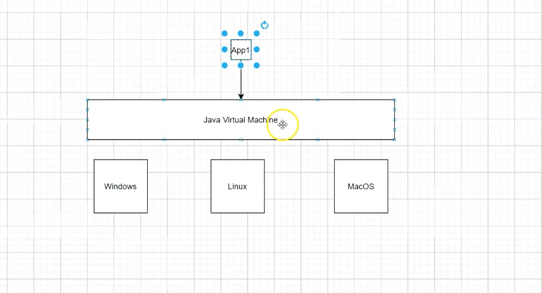
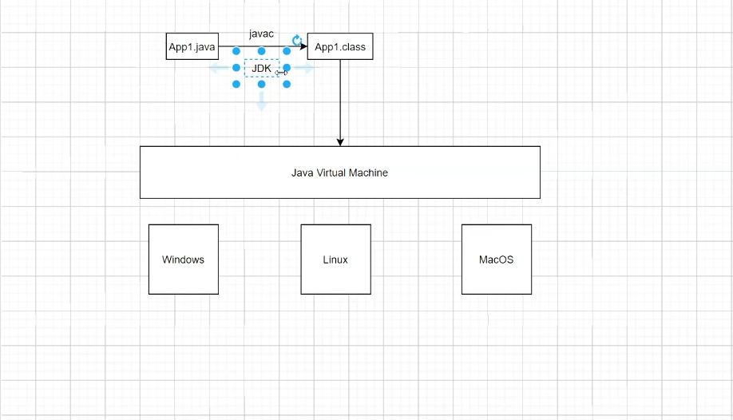
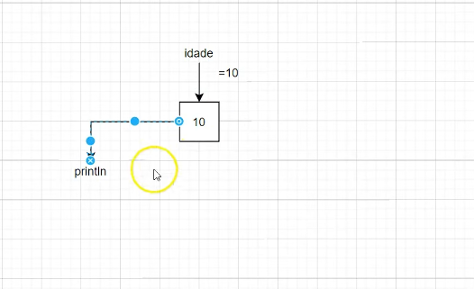
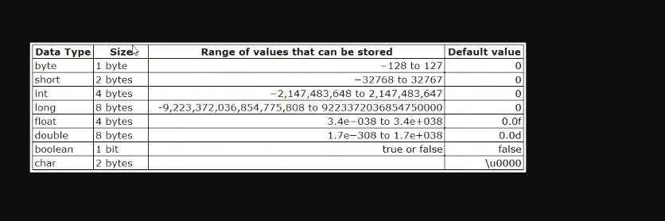
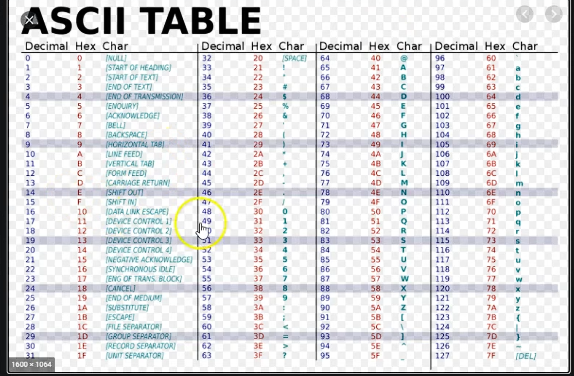
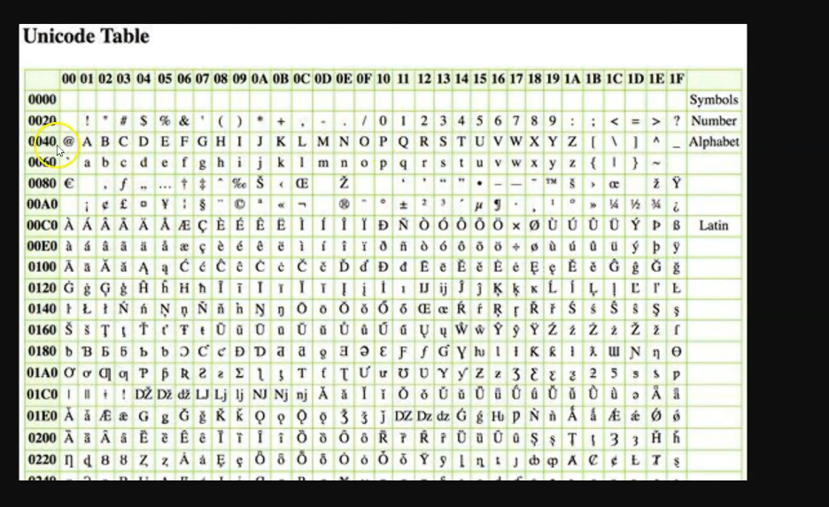
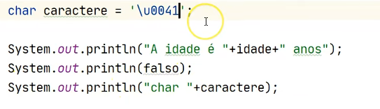

Java 15

## Como é salvo em mémoria 

Valor fica salvo na mémoria quando define uma váriavel
é acessado pelo println etc

# Tamanho das varíaveis 

O char ele vai imprimir um valor da tabela ASCII ele vai
converter compilar
 
para unicodes 

 tem que definir '\u0041'

Sempre pensar na escabilidade do seu programa !!